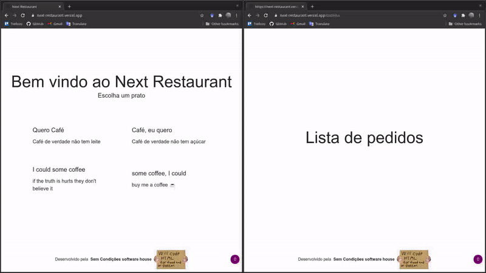
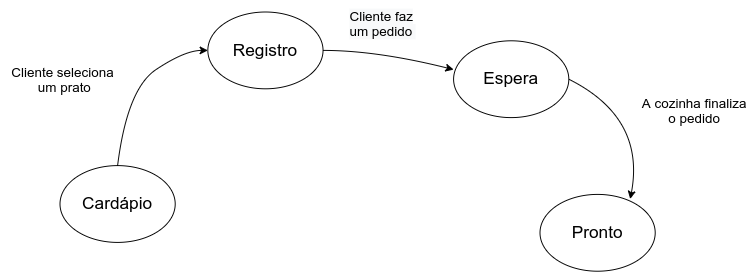

# Next Restaurant

Esse projeto visa criar o software que resolva satisfatoriamente as users stories de um restaurante.

[Restaurant User stories](user_stories.md)

Para participar do projeto você precisa ter o [nodejs](https://nodejs.org/) instalado e o [yarn](https://yarnpkg.com/lang/en/docs/install/)

- faça o fork do repositório
- instale as dependências (comando: **yarn** ou **yarn install**)
- submeta pull requests :D
- para rodar testes automatizados use **yarn test**  

Dúvidas ? estou no zap. Qualquer hora qualquer momento.

## Site da aplicação web

[next restaurant](https://next-restaurant.vercel.app) **onde o cliente irá realizar o pedido**  
[next restaurant cozinha](https://next-restaurant.vercel.app/cozinha) **onde os cozinheiros irão ver os pedidos**  

OBS: atualmente só é permitido a realização do pedido de café, qualquer outro end point é invalidado.

### Gif demonstração

### Passo a Passo para executar a demonstração

1. Abra o [next restaurant cozinha](https://next-restaurant.vercel.app/cozinha)

2. Abra o [next restaurant](https://next-restaurant.vercel.app) como cliente

3. Peça um café.

4. Na cozinha clique no pedido. Clicar no pedido significa finaliza-lo.

### Funcionamento do aplicativo

### Máquina de estados da aplicação

- Cardápio, é o estado onde o cliente vai selecionar um parto

- Registro, é o estado onde o cliente se identifica dizendo seu nome e cpf
e submete seu pedido para a cozinha.

- Espera, é o estado que a aplicação informa ao usuário que seu pedido foi enviado
e aguarda a cozinha finalizar o seu pedido.

- Pronto, é o estado onde a aplicação informa ao usuário que o pedido está pronto
para ele ir buscar.
