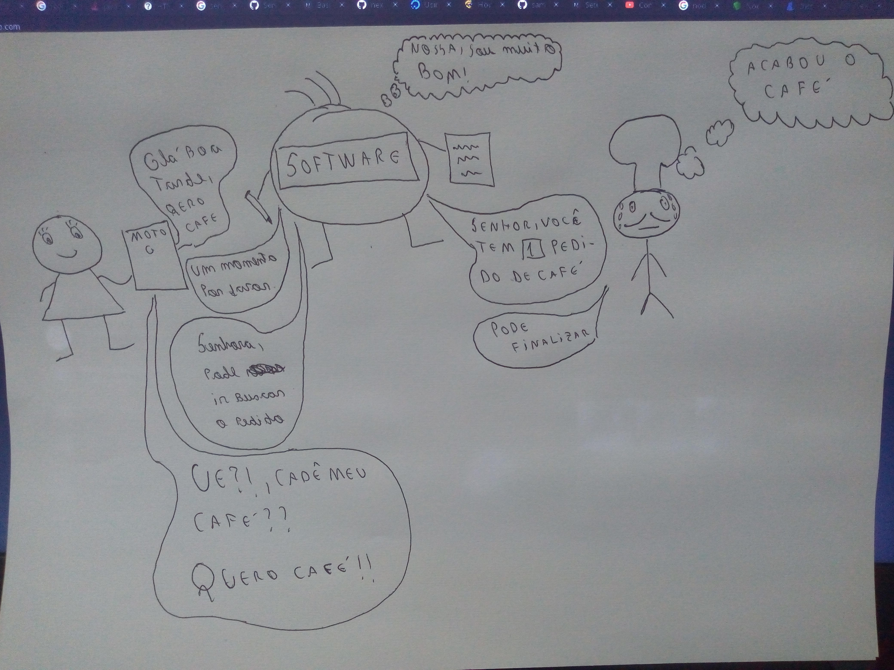

# User Stories Restaurant

## Faça um pedido

### O cliente entra no Restaurante, faz o pedido, que é encaminhado para a cozinha, ao mesmo tempo que é avisado ao cliente que o pedido está sendo preparado. No final o cozinheiro finaliza o pedido e o software notifica para o cliente ir buscar o seu pedido

